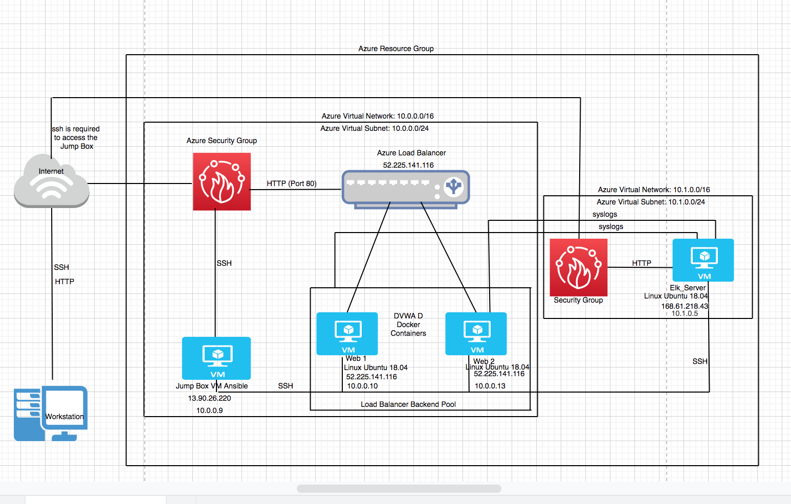
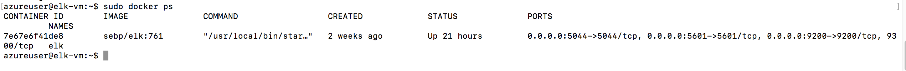
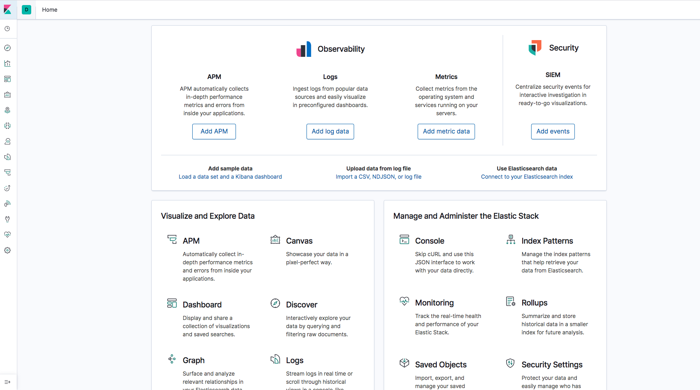

## Automated ELK Stack Deployment

The files in this repository were used to configure the network depicted below.

These files have been tested and used to generate a live ELK deployment on Azure. They can be used to either recreate the entire deployment pictured above. Alternatively, select portions of the .yml file may be used to install only certain pieces of it, such as Filebeat.

- The ansible-playbook elk.yml and the filebeat-playbook.yml are needed to create and implement the Elk-server.

This document contains the following details:
- Description of the Topology
- Access Policies
- ELK Configuration
  - Beats in Use
  - Machines Being Monitored
- How to Use the Ansible Build

 # Description of the Topology

The main purpose of this network is to expose a load-balanced and monitored instance of DVWA, the D*mn Vulnerable Web Application.

Load balancing ensures that the application will be highly available, in addition to restricting access to the network.
Load Balancers contibutes to the availablility aspect of security. Load balancers protects applications against emerging threats.  
Jump box provides another layer of security by preventing all azure VMs to expose to the public. it is the origination point for launching Administrative Tasks. This sets the Jump Box as a Secure Admin Workstation (SAW) before performing any task.

Integrating an ELK server allows users to easily monitor the vulnerable VMs for changes to the logs and system traffic.
Filebeat watches for log files and log events.
Metricbeat records metric and statistical data from the operating system and from services running on the server.

The configuration details of each machine may be found below.

| Name     | Function | IP Address | Operating System |
|----------|----------|------------|------------------|
| Jump Box | Gateway      | 10.0.0.9 | Linux Ubuntu 18.04|
| Web _1   | DVWA Server  | 10.0.0.10| Linux Ubuntu 18.04|
| Web_2    | DVWA Server  | 10.0.0.13| Linux Ubuntu 18.04|
| Elk_VM   | Elk Server   | 10.1.0.5 | Linux Ubuntu 18.04|

### Access Policies

The machines on the internal network are not exposed to the public Internet. 

Only the Jump Box machine can accept connections from the Internet. Access to this machine is only allowed from the following IP addresses:
- Personal IP Address

Machines within the network can only be accessed by SSH.
The only machine that is allowed to access the ELK VM is the Jump Box. It's IP address is 10.0.0.9

A summary of the access policies in place can be found in the table below.

| Name     | Publicly Accessible | Allowed IP Addresses |
|----------|---------------------|----------------------|
 | Jump Box | Yes/No     | Personal IP Only      |
 | Web _1   | NO         | 10.0.0.9              |
 | Web _2   | NO         | 10.0.0.9              |
 | Elk_VM   | NO         | 10.0.0.9 & Personal IP|

### Elk Configuration              

Ansible was used to automate configuration of the ELK machine. No configuration was performed manually, which is advantageous because the main advantages of automating configuration through Ansible is the ease and extremely easy learning curve. Through the use of playbooks you are able to configure multiple Machines with the use of single command after initial configuration. 

# The playbook implements the following tasks:

Below are some the steps of the ELK installation play. 

- Create a New VM Keep note of the Private IP (10.1.0.5) and the Public IP (168.61.218.43) you will need the Private IP to SSH into the VM and the Public IP to connect to the Kibana Portal (HTTP Site) to view all Metrics/Syslogs.
- Download and Configure the "elk-docker" container "In the hosts.conf you will need to add a new group [elkservers] and the Private IP (10.1.0.5) to the group. Then you need to create a new ansible-playbook (elk.yml) that will download, install, configures the Elk-Server to map the following ports [5601,9200], and starts the container.
- Launch and expose the container after installing and starting the new container. You can verify that the container is up and running by SSHing into the container from your JumpBox. Once you are in the [Elk-Server] run the command [sudo docker ps]
- Create new Inbound Security Rules to allow Ports: 5601 and 9200 "The Inbound Security Rules should allow access from your Personal Network"
 

The following screenshot displays the result of running `docker ps` after successfully configuring the ELK instance.

 

### Target Machines & Beats
This ELK server is configured to monitor the following machines:
(10.0.0.10, 10.0.0.13)

We have installed the following Beats on these machines:

- Filebeat and Metricbeat

These Beats allow us to collect the following information from each machine:

- Filebeat monitors log files or locations you specify, collects log events, and forwards them to the elk-server where you can open and inspect the with Kibana.

- Metricbeat collects metrics from the operating system and from services running on the server. Metricbeat then takes the metrics and statistics that it collects and ships them to the output that you specify.

### Using the Playbook
In order to use the playbook, you will need to have an Ansible control node already configured. Assuming you have such a control node provisioned: 

SSH into the control node and follow the steps below:
- Copy the filebeat-playbook.yml and metricbeat-playbook.yml file to the /etc/ansible/filebeat/ directory.
- Update the configuration file to include the IP OF elk server on line 1106 and 1806 

- Run the playbook, and navigate to Elk-server to check that the installation worked as expected.

Answer the following questions to fill in the blanks:_
- _Which file is the playbook? Where do you copy it? the playbook is filebeat-playbook.yml. It was copied to /etc/filebeat/filebeat.yml
- _Which file do you update to make Ansible run the playbook on a specific machine? The file to update to make ansible run the playbook is the filebeat-playbook.yml file which is a configuration file that will be dropped into the group called elkservers when running the ansible-playbook.  How do I specify which machine to install the ELK server on versus which to install Filebeat on? In order to specify which manchine to install the ELK server on versus which to install filebeat on, when updating the host.cfg file in the ansible directory, you will need to create a new elkserver group and add the Private IP of the Elk-server to the group. Then when you configure the filebeat-playbook.yml file, you will designate the Private IP of the Elk-server in lines 1106 and 1806.
- _Which URL do you navigate to in order to check that the ELK server is running?  http://[ELK.VM.PUBLIC.IP]:5601/app/kibana

The commands below are will be useful to run in order to download the playbook, update the files, etc._

ssh azadmin@JumpBox(PrivateIP)

sudo docker container list -a (locate your ansible container)

sudo docker start container (name of the container)

sudo docker attach container (name of the container)

cd /etc/ansible/

ansible-playbook elk.yml (configures Elk-Server and starts the Elk container on the Elk-Server) wait a couple minutes for the implementation of the Elk-Server

cd /etc/filebeat/

ansible-playbook filebeat-playbook.yml (installs Filebeat)

open a new web browser (Elk-Server PublicIP:5601) This will bring up the Kibana Web Portal

